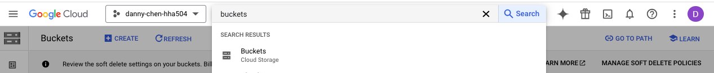
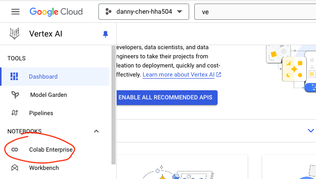
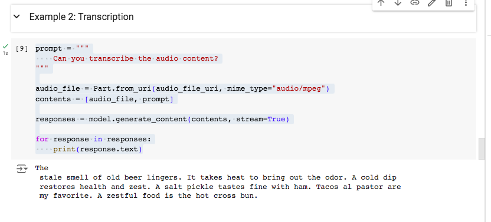
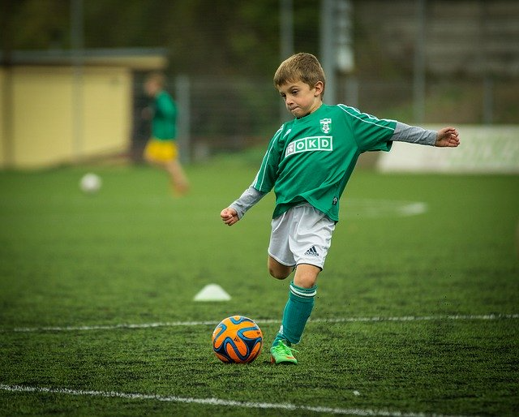
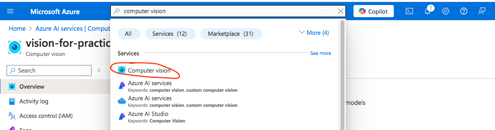
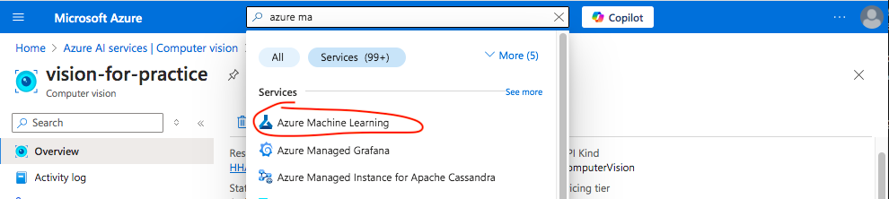
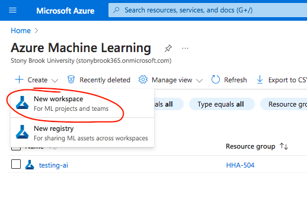
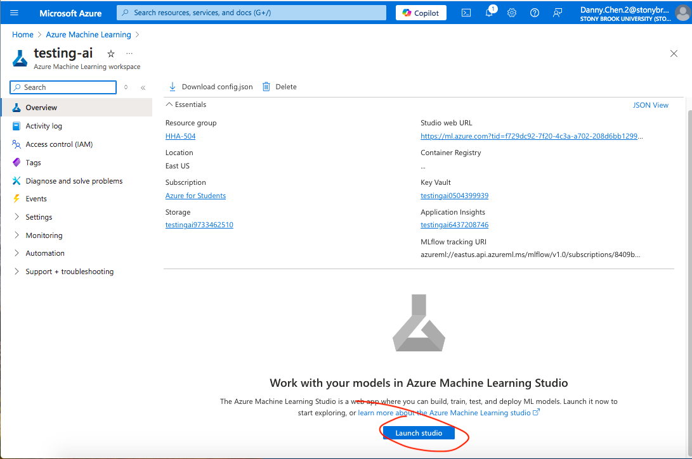
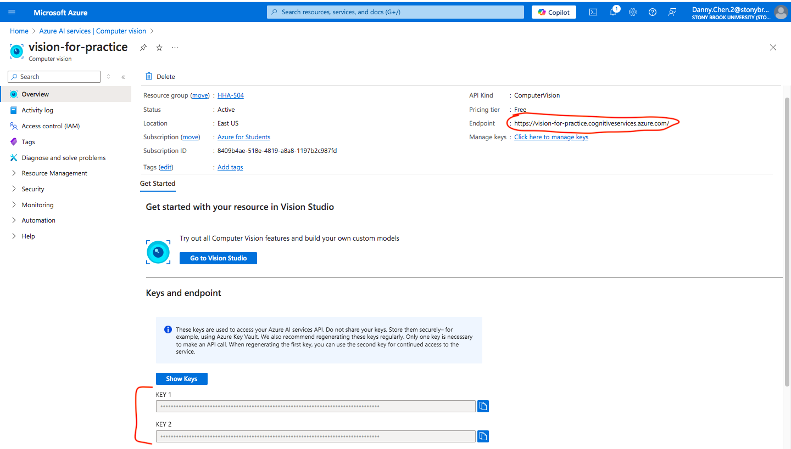
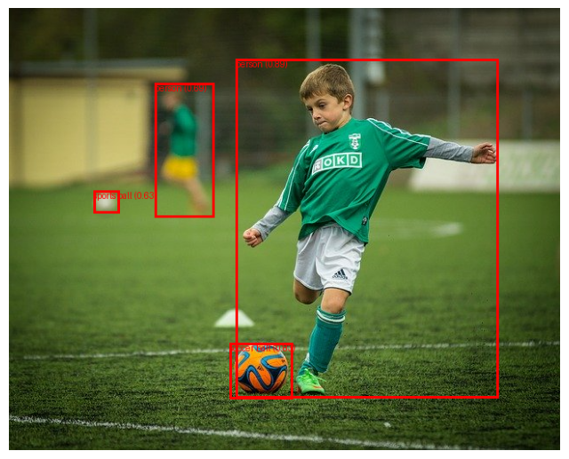

# Exploring AI and Analytics with Pre-trained Models in Azure and GCP

## 1. Work with Pre-trained Speech Models
### GCP Speech-to-Text
#### Create a Bucket in Cloud Storage
1. Click "Buckets" in the GCP search bar

2. Create a bucket with the following configuration:
    * Location type: Region
3. Click the bucket after it's made
4. Upload an mp3 file
5. Click "Permission," then click "Grant Access" and apply these configurations:
    * New principals: allUsers
    * Role: Storage Object Viewer

NOTE: The permissions above makes the bucket public, which will allow the Vertex AI notebook to access it later on

#### Speech-to-Text in Vertex AI Notebook
**NOTE**: If you run into errors that mention needing to enable certain APIs, make sure to enable them to resolve the issue.
1. Click "Vertex AI" in the GCP search bar
2. Hover to the left pane and click "Colab Enterprise"

3. Under "Sample notebooks," click "Getting started with Gemini 1.5 Flash"
    * **NOTE**: These sample notebooks are pre-configured
4. Run the default codes under "Install Vertex AI SDK for Python" up to "Load the Gemini 1.5 Flash model"
5. Under "Audio understanding," the code was adjusted as follows:
* DEFAULT CODE
```python
audio_file_path = "cloud-samples-data/generative-ai/audio/pixel.mp3"
audio_file_uri = f"gs://{audio_file_path}"
audio_file_url = f"https://storage.googleapis.com/{audio_file_path}"

IPython.display.Audio(audio_file_url)
```
* ADJUSTED CODE TO INCLUDE BUCKETS
    * **Reason**: Google Cloud Storage (GCS) files have paths that include the bucket name and the file path within that bucket. 
```python
# Define bucket name and file path
bucket_name = "transcription_use"  # Replace with your actual bucket name
file_name = "harvard.mp3"

# GCS URI and Public URL
audio_file_uri = f"gs://{bucket_name}/{file_name}"
audio_file_url = f"https://storage.googleapis.com/{bucket_name}/{file_name}"

IPython.display.Audio(audio_file_url)
```
6. Under "Example 2: Transcription," adjust the prompt to simply transcribe the audio content. Leave the remaining default code as is.
```python
prompt = """
    Can you transcribe the audio content?
"""
```
7. [gemini_1_5_flash](https://github.com/dnce17/HHA504_assignment_ai/blob/main/gemini_1_5_flash.ipynb) contains the code used to detect objects in image

**Results**


## 2. Work with Pre-trained Vision Models
### GCP Vision API
1. Upload an image in a bucket
2. Under "All modalities (images, video, audio, text) at once," go to the image-related default codes and alter it as follows:
* DEFAULT CODE
```python
image_file_path = "cloud-samples-data/generative-ai/image/a-man-and-a-dog.png"
image_file_uri = f"gs://{image_file_path}"
image_file_url = f"https://storage.googleapis.com/{image_file_path}"

IPython.display.Image(image_file_url, width=450)
```
* ADJUSTED CODE
```python
# Define bucket name and file path
image_file_name = "kids_playing_soccer.png"  # Change with your own file name

# GCS URI and Public URL
image_file_uri = f"gs://{bucket_name}/{image_file_name}"
image_file_url = f"https://storage.googleapis.com/{bucket_name}/{image_file_name}"

IPython.display.Image(image_file_url, width=450)
```
``` python
image_file = Part.from_uri(image_file_uri, mime_type="image/png")

# Adjust your prompt as needed for your image
prompt = """
  How many kids are in the image? How many soccer balls? How many agility soccer cones?
"""

contents = [image_file, prompt]

response = model.generate_content(contents)
print(response.text)
```
* Image + Results

```txt
Here are the answers based on the image:

* **Kids:** There are two kids in the image. One is prominently featured in the foreground, actively playing soccer. The other is in the background, appearing to be another player.

* **Soccer balls:** There are two soccer balls visible. One is in the foreground, near the boy's feet, and the other is in the background, further away.

* **Agility cones:** There is one agility cone partially visible in the background.
```

### Azure AI Vision
#### Create Computer Vision
1. Click "Computer vision" from the search bar

2. Click "Create" and apply the following configuration
    * Select your subscription, resource group, region, and add a name
    * Pricing tier: Free

#### Create the Azure Machine Learning (AML) Notebook
1. Click "Azure Machine Learning" from the search bar

2. Click "Create" and then "New workspace"

3. After selecting a subscription, resource group, region, and adding a name, create the workspace
4. Click the newly created workspace, then select "Launch studio"

5. In the Home tab, click "Create notebook"
6. Upload an image into the "File" section
7. [azure_ai.ipynb](https://github.com/dnce17/HHA504_assignment_ai/blob/main/azure_ai.ipynb) contains the code used to detect objects in image
    * The subscription key and endpoint of the created workspace is used here


**Results**
```txt
Object: sports ball, Confidence: 0.634, Bounding Box: {'x': 98, 'y': 212, 'w': 30, 'h': 26}
Object: soccer ball, Confidence: 0.832, Bounding Box: {'x': 256, 'y': 389, 'w': 73, 'h': 65}
Object: person, Confidence: 0.694, Bounding Box: {'x': 169, 'y': 87, 'w': 69, 'h': 156}
Object: person, Confidence: 0.891, Bounding Box: {'x': 263, 'y': 59, 'w': 305, 'h': 394}
```


## 3. Comparison and Reflection of Accuracy and Result in GCP and Azure
GCP's AI model appears to be more accurate than Azure's model in detecting objects in images. However, this may partly be due to how users can enter a prompt in GCP, which allows them to be more clear with what they want detected from the image in contrast to Azure that does not offer prompts. In the image above, I told GCP's model to specifically identify the amount of kids, soccer ball, and agility cones, which it was able to do with high accuracy. On the other hand, Azure was able to identify the amount of kids and balls correctly, but was unable to detect the agility cone.

In terms of ease of use, I found GCP to be much easier to use than Azure. I felt the code and instructions provided through GCP's notebook sample for Gemini 1.5 Flash was clearer in what they meant and the default code all ran without issue, allowing me to get a quicker sense of what the code did and alter and run it without significant difficulty. In contrast, the instructions and code provided for Azure's image classification notebook felt the opposite and seemed to require much more steps than GCP to perform the desired function. However, Azure's image classification notebook appeared to focus more on training the model than the task itself. Thus, I opted to utilize ChatGPT to provide code for objection detection in Azure, which was successful after slight modifications.

Overall, I currently feel that GCP is more user-friendly than Azure.

## 4. Challenges and Resolution
### GCP's Gemini 1.5 Flash model
One issue I ran into was the audio file not processing correctly although I uploaded it to GCP's file section. I double checked and the path to the image was correct, so I was not sure what else to do. As such, I pasted the below code to ChatGPT and asked why the code was not working although the path was correct. 
```python
image_file_path = "/content/kids_playing_soccer.png"
image_file_uri = f"gs://{image_file_path}"
image_file_url = f"https://storage.googleapis.com/{image_file_path}"

IPython.display.Image(image_file_url, width=450)
```
It was through ChatGPT that I discovered that I needed to create a bucket inside Google Cloud Storage and upload my files there to later access from the notebook, which proved successful in getting GCP's speech-to-text and object detection to work. 

### Azure's Computer Vision
I looked through Azure's preconfigured notebook samples to see if they had code related to object detection in some way. However, image classification was the closest function I found. But even within the realm of image classification, the samples seem to emphasize providing data to train models rather than executing specific tasks, like classification itself. As such, I used ChatGPT to aid in creating the code for object detection in the notebook, which provided successful.

## Credits
1. ChatGPT
2. [How to Set Buckets and Files Public In Google Cloud Storage](https://www.youtube.com/watch?v=3V8aDWRreFU)